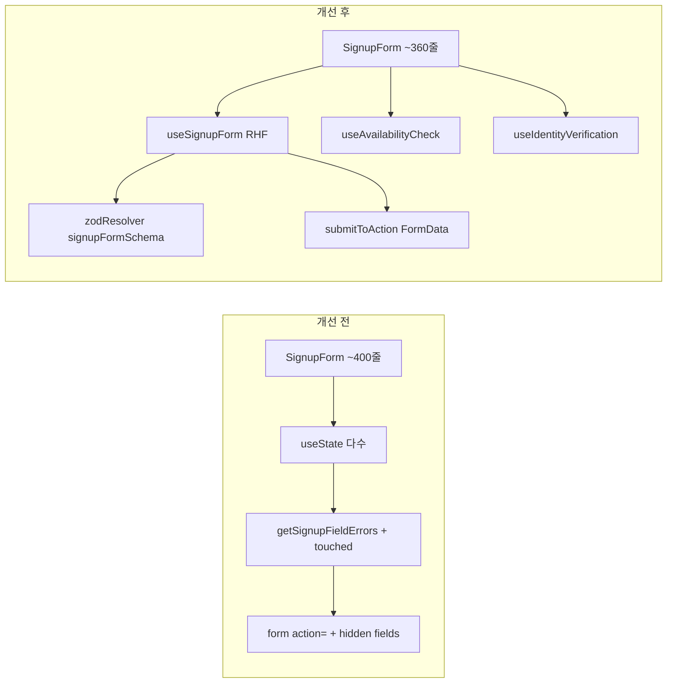
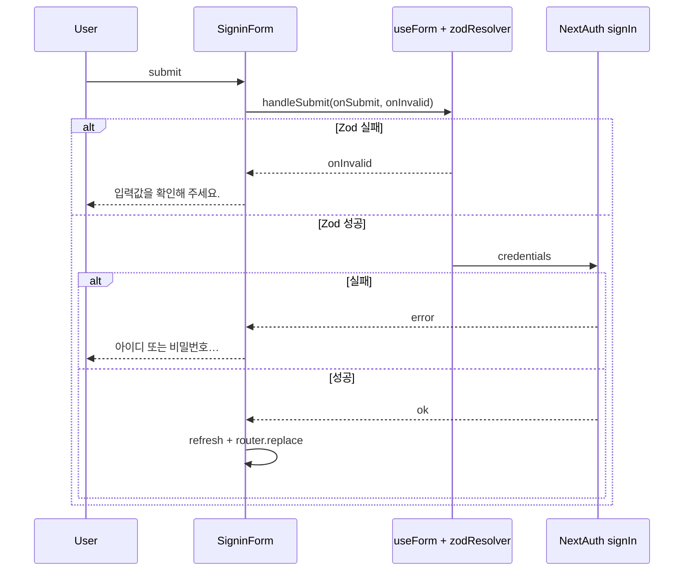

# ValueHub-FO 폼 리팩터링 (SignupForm · SigninForm)

회원가입·로그인 폼을 **React Hook Form(RHF) + Zod** 기반으로 전환한 작업을 정리한 문서입니다.

---

## 1. 개요

| 항목            | 내용                                                                     |
| --------------- | ------------------------------------------------------------------------ |
| **대상**        | `SignupForm`, `SigninForm` 및 관련 hooks·types                           |
| **목표**        | 수동 상태·검증 로직을 RHF + Zod로 일원화, 관심사 분리, 제출·에러 UX 개선 |
| **추가 의존성** | `react-hook-form` ^7.84.0, `@hookform/resolvers` ^5.7.1                  |
| **부가 작업**   | `Spinner` atom 추가, `tsconfig.json` `baseUrl` 설정                      |



---

## 2. SignupForm — 개선 전 / 개선 후

### 구조

|               | 개선 전                                             | 개선 후                                     |
| ------------- | --------------------------------------------------- | ------------------------------------------- |
| **파일**      | `SignupForm.tsx` 단일 파일 (~400줄)                 | `SignupForm.tsx` + `hooks/auth/*` 3개       |
| **역할 분리** | 폼 상태·본인인증·중복확인·약관이 한 컴포넌트에 혼재 | 폼 코어 / 중복확인 / 본인인증 hook으로 분리 |
| **UI 바인딩** | controlled `value` + `updateField`                  | `Controller` + `field.onChange`             |

**개선 후 hook 구성**

| Hook                      | 책임                                                  |
| ------------------------- | ----------------------------------------------------- |
| `useSignupForm`           | RHF 초기화, 서버 `fieldErrors` 반영, `submitToAction` |
| `useAvailabilityCheck`    | 아이디·이메일 중복확인 API, `checkedValue` gate       |
| `useIdentityVerification` | PortOne 본인인증, `requestToken`, 이름·휴대폰 prefill |

### 상태 관리

|               | 개선 전                                      | 개선 후                                              |
| ------------- | -------------------------------------------- | ---------------------------------------------------- |
| **폼 값**     | `useState<SignupInput>(values)`              | RHF `defaultValues` + `control`                      |
| **터치 추적** | `useState<TouchedFields>(touched)` 수동 관리 | RHF `touchedFields`, `isSubmitted`                   |
| **서버 에러** | `state.fieldErrors`를 `useMemo`로 merge      | `useEffect` → `setError(..., { type: "server" })`    |
| **값 복원**   | `requestAnimationFrame` + `setValues`        | `reset(..., { keepErrors, keepDirty, keepTouched })` |
| **부가 UI**   | 약관·닉네임·주소는 여전히 로컬 `useState`    | RHF `terms`·`nickname`·`region` 필드 (API 미전송)    |

### 검증

|                   | 개선 전                                                                  | 개선 후                                                                       |
| ----------------- | ------------------------------------------------------------------------ | ----------------------------------------------------------------------------- |
| **스키마**        | `types/auth/signup.ts`의 `signupSchema` + `getSignupFieldErrors(values)` | `signupFormSchema`(API 필드 + 약관·닉네임·주소)를 `zodResolver`로 RHF에 연결  |
| **실시간 검증**   | `values` 변경마다 `useMemo`로 전 필드 re-parse                           | RHF `mode: "onChange"`                                                        |
| **에러 표시**     | `touched` \|\| 서버 에러일 때만 표시                                     | `getFieldError`: 서버 우선 → `touchedFields` \|\| `isSubmitted`               |
| **중복확인 gate** | **없음** (성공 톤만 UI 표시)                                             | `verifyLoginId` / `verifyEmail` + `checkedValue` 비교                         |
| **약관·본인인증** | `handleSubmit`에서 `preventDefault`만                                    | RHF `handleSubmit(onSubmit)` — 약관은 `superRefine`, 본인인증·중복확인은 gate |

### 제출

|                  | 개선 전                                                   | 개선 후                                                                 |
| ---------------- | --------------------------------------------------------- | ----------------------------------------------------------------------- |
| **방식**         | `<form action={formAction}>` 네이티브 제출 + hidden input | `handleSubmit(onSubmit)` → `submitToAction` → `FormData` + `formAction` |
| **hidden field** | `requestToken`, `name`, `phone`                           | FormData에 프로그래밍 방식으로 set                                      |
| **제출 전 검증** | 약관·본인인증만                                           | Zod + 약관 + 본인인증 + **중복확인 gate**                               |

---

## 3. SignupForm — 기존 문제점

1. **단일 거대 컴포넌트** — 폼·본인인증(PortOne)·중복확인·에러 merge가 한 파일에 몰려 가독성·테스트·재사용이 어려웠습니다.
2. **수동 touched / 에러 merge** — `touched`, `realtimeErrors`, `fieldErrors`를 `useMemo`로 조합하는 보일러플레이트가 반복되었습니다.
3. **네이티브 form action 혼용** — controlled input + `action={formAction}` + hidden field 조합은 React 상태와 DOM 제출 타이밍이 어긋날 여지가 있었습니다.
4. **중복확인 우회 가능** — 중복확인 성공 후 아이디·이메일을 바꿔도 제출이 가능했습니다 (`checkedValue` 부재).
5. **비밀번호 hint 불일치** — UI hint(「특수문자 1개… 영문·숫자」)가 auth-service / Zod 규칙(대소문자·숫자·특수문자 각 1자)과 달랐습니다.
6. **로딩 UX** — 「가입 중…」 텍스트만 표시, 버튼·중복확인에 일관된 스피너 없음.
7. **`handleSubmit` 역할 제한** — 약관·본인인증 gate만 담당하고, Zod·중복확인은 제출 경로 밖이었습니다.

---

## 4. SignupForm — 개선 후 좋아진 점

- **관심사 분리** — 본인인증·중복확인을 hook으로 빼 폼 JSX가 「필드 배치 + gate 호출」에 집중합니다.
- **검증 단일 소스** — 클라이언트는 `zodResolver`, 서버 Action은 동일 `signupSchema` — 규칙 drift 감소.
- **서버 에러 1급 시민** — Action `fieldErrors`가 RHF `setError`로 필드에 직접 매핑됩니다.
- **제출 파이프라인 명확** — `handleSubmit` → gate(약관·본인·중복) → `submitToAction` 순서가 한 함수에 드러납니다.
- **Controller 패턴** — 커스텀 molecule(`SigninInputField`, `SignupFieldWithAction`)과 RHF 상태가 `field.onChange`로 안전하게 연결됩니다.
- **접근성** — `Spinner`에 `role="status"`, `aria-busy`, `inline` 모드로 버튼 내 로딩 표시.

---

## 5. SignupForm 추가 개선 (리뷰 반영)

리뷰에서 지적·보완된 항목입니다.

| 항목                               | 내용                                                                                                                                        |
| ---------------------------------- | ------------------------------------------------------------------------------------------------------------------------------------------- |
| **`handleSubmit`**                 | 네이티브 `action=` 제거, RHF `handleSubmit(onSubmit)` 단일 진입점                                                                           |
| **`field.onChange`**               | `Controller` render prop에서 `onChange={(v) => { field.onChange(v); clear*Check(); }}` — RHF dirty/touch와 중복확인 초기화 동시 처리        |
| **비밀번호 hint**                  | auth-service 규칙과 동일하게 수정: 「비밀번호는 8~20자, 영문 대문자·소문자·숫자·특수문자(!@#$%^&*()-+_=)를 각각 1자 이상 포함해야 합니다.」 |
| **중복확인 gate (`checkedValue`)** | 성공 시 `checkedValue` 저장 → 제출 시 현재 값과 비교. 변경 시 「다시 중복 확인」 메시지                                                     |

```typescript
// useAvailabilityCheck — gate 핵심
if (trimmed !== loginIdCheck.checkedValue) {
  return "아이디가 변경되었습니다. 다시 중복 확인해 주세요.";
}
```

---

## 6. SigninForm — 개선 전 / 개선 후

SigninForm은 필드가 2개뿐이라 **별도 `useSigninForm` hook 없이** 컴포넌트 내부에 RHF를 인라인으로 두었습니다.

|               | 개선 전                                                     | 개선 후                                            |
| ------------- | ----------------------------------------------------------- | -------------------------------------------------- |
| **상태**      | `useState(values)` + `touched` + `submitAttempted`          | `useForm` + `zodResolver(signinSchema)`            |
| **검증**      | `getSigninFieldErrors` + submit 시 `signinSchema.safeParse` | RHF resolver + `handleSubmit(onSubmit, onInvalid)` |
| **필드**      | props 직접 전달                                             | `Controller` → `SigninInputField`                  |
| **로그인**    | `signIn("credentials", …)` 동일                             | 동일                                               |
| **세션**      | `useSession()`                                              | `useAppSession()` (컨텍스트 rename)                |
| **로딩**      | 텍스트 「로그인 중…」                                       | `Spinner` (폼·버튼)                                |
| **에러 표시** | `submitAttempted \|\| touched`                              | `touchedFields \|\| isSubmitted`                   |



---

## 7. SigninForm — 기존 문제점 / 개선 후

### 기존 문제점

- SignupForm과 **동일한 수동 패턴** (`values`, `touched`, `getSigninFieldErrors`, `useMemo`) 반복.
- 검증이 **submit 시점 `safeParse`**와 **입력 중 `getSigninFieldErrors`** 두 경로로 나뉨.
- `submitAttempted` 플래그가 Signup의 `isSubmitted`와 **컨벤션 불일치**.
- 로딩·접근성 표현이 SignupForm과 다름.

### 개선 후

- RHF + Zod로 Signup과 **동일한 검증·에러 표시 패턴** (`getFieldError` 헬퍼).
- 코드량이 적어 hook 분리 없이 **인라인 `useForm`이 더 단순**.
- `onInvalid` 콜백으로 클라이언트 검증 실패 메시지 명시.
- 입력 시 `setMessage(undefined)`로 서버(인증) 에러 초기화 유지.

---

## 8. 공통 컨벤션 (RHF + Zod + Controller + Server Action / signIn)

### Zod 스키마 (`types/auth/`)

- **`signup.ts`** — auth-service sign-up 규칙과 동기화 (`LOGIN_ID_PATTERN`, `PASSWORD_PATTERN`, `refine`으로 비밀번호 확인).
- **`signin.ts`** — loginId 동일 regex, password 8~20자.
- **`getSignupFieldErrors` / `getSigninFieldErrors`** — Server Action 등 RHF 밖에서도 재사용 가능 (Signup Action에서 server-side 검증).

### RHF 설정

```typescript
useForm<Input>({
  resolver: zodResolver(schema),
  defaultValues: emptyValues,
  mode: "onChange",
});
```

### Controller + 커스텀 필드

- molecule은 `value` + `onChange(value: string)` API 유지.
- `Controller`의 `field.onChange`를 반드시 호출해 RHF 내부 상태와 동기화.
- 서버/클라이언트 에러는 `getFieldError(name)`으로 통일: **서버 → touched/submitted → resolver errors** 순.

### 제출 경로

| 폼         | 제출                                                                 |
| ---------- | -------------------------------------------------------------------- |
| **Signup** | RHF valid → gate → `submitToAction` → `useActionState(signupAction)` |
| **Signin** | RHF valid → `signIn("credentials")` → `refresh` + redirect           |

### 기타

- **`noValidate`** — 브라우저 기본 검증 비활성, Zod 메시지 사용.
- **`Spinner`** (`components/atoms/spinner.tsx`) — `inline` / `role="status"` / `aria-busy`.
- **`tsconfig.json`** — `"baseUrl": "."` 로 `@/*` path alias 해석 안정화.

---

## 9. 장점

| 영역            | 설명                                                                          |
| --------------- | ----------------------------------------------------------------------------- |
| **유지보수**    | 검증 규칙 변경 시 Zod 스키마 한 곳 + resolver 연결                            |
| **일관성**      | 두 폼 모두 RHF + Zod + Controller + `getFieldError` 패턴                      |
| **Signup 확장** | 본인인증·중복확인 hook은 다른 화면에서도 재사용 가능                          |
| **UX**          | 중복확인 gate, auth-service와 맞춘 hint, 스피너·`aria-busy`                   |
| **서버 연동**   | Signup은 Action `fieldErrors` ↔ RHF `setError` 브릿지로 서버 검증 피드백 유지 |
| **타입 안전**   | `SignupInput` / `SigninInput` = `z.infer<typeof schema>`                      |

---

## 10. 단점 / trade-off

| trade-off                   | 설명                                                                                               |
| --------------------------- | -------------------------------------------------------------------------------------------------- |
| **번들 크기**               | `react-hook-form` + `@hookform/resolvers` 추가 (~수 KB gzip). 필드 2개인 Signin에도 동일 스택 적용 |
| **학습 곡선**               | RHF(`Controller`, `handleSubmit`, `setError`, `reset` 옵션)에 익숙해야 함                          |
| **Signup vs Signin 비대칭** | Signup은 hook 3개 분리, Signin은 인라인 — **의도적**이나 팀 컨벤션 설명 필요                       |
| **이중 검증**               | Signup은 클라이언트 Zod + 서버 Action Zod + 중복확인 gate — 방어적이지만 경로가 많음               |
| **Controller 보일러플ate**  | 필드마다 `Controller` wrapper — 필드 수가 많을수록 JSX 길어짐                                      |
| **의존성**                  | RHF major 업그레이드 시 resolver·타입 호환 확인 필요                                               |

---

## 11. 향후 고려사항 (optional)

- **`useSigninForm` 추출** — 로그인 필드가 늘거나 소셜·2FA 등이 붙으면 Signup과 같이 hook 분리 검토.
- **닉네임·주소 연동** — member-service / 주소 API 연결 시 RHF 필드·중복확인 hook 패턴 재사용.
- **통합 테스트** — 중복확인 gate, 서버 `fieldErrors` 반영, 본인인증 prefill E2E.
- **Signin password 규칙** — signin은 8~20자만 검증; sign-up과 메시지·hint 정책 통일 여부.

---

## 참고 파일

| 경로                                    | 역할                     |
| --------------------------------------- | ------------------------ |
| `components/organisms/SignupForm.tsx`   | 회원가입 UI              |
| `components/organisms/SigninForm.tsx`   | 로그인 UI                |
| `hooks/auth/useSignupForm.ts`           | RHF + Action 브릿지      |
| `hooks/auth/useAvailabilityCheck.ts`    | 중복확인 + gate          |
| `hooks/auth/useIdentityVerification.ts` | PortOne 본인인증         |
| `types/auth/signup.ts`                  | Signup Zod 스키마        |
| `types/auth/signin.ts`                  | Signin Zod 스키마        |
| `components/atoms/spinner.tsx`          | 로딩 UI                  |
| `actions/auth.ts`                       | `signupAction` 서버 검증 |
