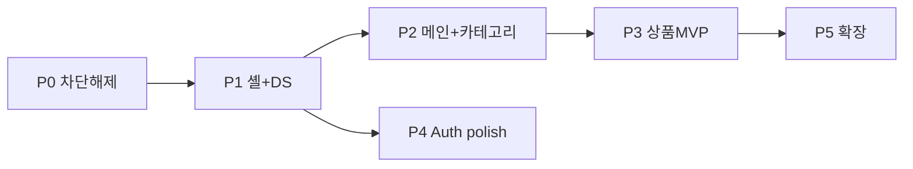

# ValueHub-FE 프론트 작업 우선순위 · UI 개선 백로그

> **기능 구현 · API 연동 · UI 디자인 반영**을 한 기준으로 정렬한 통합 백로그입니다.  
> 갱신: 2026-08-19

관련: [project-overview.md](./project-overview.md) · [DEVELOPMENT.md](./DEVELOPMENT.md)

---

## 1. 우선순위 기준

작업은 아래 **세 가지 영역**(기능 · API · UI)으로 나눠 보고, **통합 P등급**으로 묶습니다.

| 영역     | 의미                                           | 상태 표기                              |
| -------- | ---------------------------------------------- | -------------------------------------- |
| **기능** | 사용자 시나리오·페이지·로직                    | ✅ 완료 · △ 부분 · ❌ 없음             |
| **API**  | 3-Layer (`types` → `lib/api` → `service` → UI) | ✅ 연동 · △ BFF/일부 · ❌ 미연동       |
| **UI**   | 디자인 시스템·Figma 반영                       | ✅ 반영 · △ 목업/부분 · ❌ placeholder |

### 통합 P등급 정의

| 등급   | 이름            | 선행 조건              | 목표                                                |
| ------ | --------------- | ---------------------- | --------------------------------------------------- |
| **P0** | 차단 해제       | —                      | 회원가입·배포·팀 공통 기반                          |
| **P1** | 셸 + DS         | P0                     | Header/Footer/공통 컴포넌트 — 이후 모든 화면의 토대 |
| **P2** | 메인 탐색       | P1 + category API 스펙 | 홈 → 카테고리 → (목록 진입)                         |
| **P3** | 상품 코어       | P2 + product API 스펙  | 검색·목록·상세 — 마켓 MVP                           |
| **P4** | Auth·GNB polish | P1                     | 로그인/가입 UX·일관성                               |
| **P5** | 확장            | P3                     | 채팅·판매·소셜·E2E                                  |

**권장 가이드** (팀 워크플로 — 상황에 따라 조정 가능)

| #   | 가이드                                                                       | 예외·유연하게                                                                                                                             |
| --- | ---------------------------------------------------------------------------- | ----------------------------------------------------------------------------------------------------------------------------------------- |
| 1   | BE API **스펙이 잡히면** UI·API를 가까운 시점에 맞춘다                       | **공통 UI**(FormField, Skeleton, Dialog), **목업/스텁 데이터**로 레이아웃만 먼저 (메인 검색·카테고리처럼). Figma 시안 검토용 UI prototype |
| 2   | 스프린트 마감 단위는 **데모 가능한 vertical slice**를 권장 (page + API + UI) | API layer PR → UI PR **순차 분리** 가능. 단, 중간에 «화면만 완성» 상태가 길어지지 않게                                                    |
| 3   | 디자인 반영은 **P1(셸·DS) → P2(메인) → P3(상품)** 순을 기본으로              | Auth polish(P4) 등 **병행** 가능. DS(Header, Dialog, 토큰)만 먼저 잡으면 재작업이 줄어듦                                                  |

**아키텍처상 필수** (가이드와 별개 — [AGENTS.md](../AGENTS.md) · `.cursor/rules`)

- 클라이언트에서 `lib/api` · `services` import 금지 → Server Action 또는 BFF Route
- HTTP·Gateway URL은 `lib/api/*` + 서버 env만 (prod에서 `NEXT_PUBLIC_*`로 BE URL 노출 금지)

---

## 2. 도메인별 현황 (기능 · API · UI)

| 도메인             | 기능 | API (FE)                         | UI            | 비고               |
| ------------------ | ---- | -------------------------------- | ------------- | ------------------ |
| **Auth 로그인**    | ✅   | ✅ auth-service                  | ✅            | reCAPTCHA 포함     |
| **Auth 회원가입**  | ✅   | ✅ auth + member + terms         | ✅            | CI 환경 이슈(P0)   |
| **약관**           | ✅   | ✅ terms + BFF                   | ✅            | TermDetailModal    |
| **본인인증**       | ✅   | ✅ PortOne confirm               | ✅            | 카카오 CI 계약     |
| **메인 홈**        | △    | ❌ category/product              | △             | 검색·카테고리 목업 |
| **카테고리**       | ❌   | ❌ `CATEGORY_API_URL` 미사용     | △             | constants 하드코딩 |
| **상품 목록/검색** | ❌   | ❌ `PRODUCT_POST_API_URL` 미사용 | ❌            | `/feeds` 미구현    |
| **상품 상세**      | ❌   | ❌                               | ❌            |                    |
| **Header/Footer**  | △    | — (세션 status만)                | △ / ❌        | Footer null        |
| **채팅**           | ❌   | ❌                               | ❌            | 미구현             |
| **소셜 로그인**    | ❌   | ❌                               | △ disabled UI |                    |

### FE에 연동된 API (현재)

| 서비스         | env              | `lib/api/endpoints`        |
| -------------- | ---------------- | -------------------------- |
| auth-service   | `API_URL`        | auth, identityVerification |
| member-service | `MEMBER_API_URL` | members, terms             |

### FE에 env만 있고 **코드 미연동**

| 서비스               | env                    | 필요 작업                                           |
| -------------------- | ---------------------- | --------------------------------------------------- |
| category-service     | `CATEGORY_API_URL`     | endpoints + `lib/api/categories.ts` + service + UI  |
| product-post-service | `PRODUCT_POST_API_URL` | endpoints + `lib/api/products.ts` + service + pages |
| chat-service         | `CHAT_API_URL`         | P5                                                  |

---

## 3. 통합 백로그 (Epic 단위)

> **기능 · API · UI** 항목별로 이번 Epic에서 **해야 할 일**을 적었습니다. ✅ = 이미 충분.

### P0 — 차단 해제 (즉시 ~3일)

| ID       | Epic           | 기능                                    | API                 | UI  | 담당 메모               |
| -------- | -------------- | --------------------------------------- | ------------------- | --- | ----------------------- |
| **P0-1** | 본인인증 E2E   | CI/PortOne/BE 조율로 가입 완료 가능하게 | △ confirm ✅, CI BE | —   | PASS로 우회 테스트 가능 |
| **P0-2** | Auth 회귀 확인 | signin/signup/resume smoke              | ✅ 유지             | —   | BE 배포 후 재확인       |

### P1 — 레이아웃 셸 + 디자인 시스템 (3~5일)

> **API 없이 진행 가능.** 이후 모든 Epic의 선행.

| ID       | Epic             | 기능                                      | API                       | UI                                         |
| -------- | ---------------- | ----------------------------------------- | ------------------------- | ------------------------------------------ |
| **P1-1** | 공통 Form        | `input`/`label`/`FormField` atom·molecule | —                         | SigninInputField 패턴 추출, VH 밑줄 스타일 |
| **P1-2** | Dialog 통합      | Confirm + TermDetail → `Dialog` base      | —                         | dark 테마 통일, backdrop/ESC               |
| **P1-3** | Header           | 로고→`/`, auth, skeleton                  | `GET /api/auth/status` ✅ | U: 로고·로딩 pulse                         |
| **P1-4** | Footer           | 약관·copyright·링크                       | terms 링크만              | dark bar + gold border                     |
| **P1-5** | Auth 화면 polish | 소셜 섹션 숨김                            | —                         | AuthDivider 제거, ConfirmModal dark        |
| **P1-6** | Card·Feedback    | `Card`, `Skeleton`, `EmptyState`          | —                         | 상품·목록 전 공통                          |

### P2 — 메인 + 카테고리 (1주, **BE 스펙 필요**)

| ID       | Epic          | 기능                                    | API                                        | UI                                         |
| -------- | ------------- | --------------------------------------- | ------------------------------------------ | ------------------------------------------ |
| **P2-1** | Category API  | 카테고리 트리/목록 조회                 | `types/category/*` → `lib/api` → `service` | —                                          |
| **P2-2** | 메인 카테고리 | 클릭 → 목록(또는 검색) 라우팅           | P2-1 소비                                  | active gold, `aria-pressed`, hover         |
| **P2-3** | 메인 레이아웃 | spacing·배너 처리                       | —                                          | hero gap 토큰화, placeholder 숨김/skeleton |
| **P2-4** | 검색바 1차    | submit → 목록 query (`q`, `categoryId`) | product API 또는 search stub               | category Select (P2-1 데이터)              |

**BE 의존:** category-service API path·DTO 확정 → `API_ENDPOINTS.categories.*` 추가.

### P3 — 상품 MVP (1~2주, **BE 스펙 필요**)

| ID       | Epic           | 기능                          | API                                                   | UI                                        |
| -------- | -------------- | ----------------------------- | ----------------------------------------------------- | ----------------------------------------- |
| **P3-1** | Product API    | 목록·상세·(검색)              | `types/product/*` → `lib/api` → `service`, cache tags | —                                         |
| **P3-2** | 상품 목록 page | `/products` 또는 `/feeds` RSC | P3-1 list                                             | ProductCard grid, Skeleton, Empty         |
| **P3-3** | 상품 상세 page | `/products/[id]` RSC          | P3-1 detail                                           | 갤러리, Price gold, Badge, sticky CTA bar |
| **P3-4** | 검색 결과      | MainSearchBar → P3-2          | P3-1 search query                                     | 필터·정렬 UI는 2차                        |

**BE 의존:** product-post-service list/detail/search contract.

### P4 — Auth·가입 UX polish (P1과 병행 가능)

| ID       | Epic            | 기능               | API | UI                                                   |
| -------- | --------------- | ------------------ | --- | ---------------------------------------------------- |
| **P4-1** | Signup step UI  | —                  | —   | progress bar, 완료 step 체크                         |
| **P4-2** | Signup 3단계    | sticky CTA         | —   | 섹션 구분, FormField 적용                            |
| **P4-3** | Signin layout   | —                  | —   | `-mt-[60px]` 제거, signup과 정렬 통일                |
| **P4-4** | SignupForm 분리 | step organism 추출 | —   | 유지보수 (~510줄)                                    |
| **P4-5** | DS 정리         | —                  | —   | typography atom 사용, radius 규칙, `#d9d9d9` → token |

### P5 — 확장 (기획·BE 후)

| ID       | Epic        | 기능                   | API                    | UI                 |
| -------- | ----------- | ---------------------- | ---------------------- | ------------------ |
| **P5-1** | Route guard | `/chat`, 마이페이지 등 | middleware/proxy       | —                  |
| **P5-2** | 채팅        | room list, SSE         | CHAT_API + `lib/chat/` | ChatRoom UI        |
| **P5-3** | 상품 등록   | seller form            | product POST           | FormField + upload |
| **P5-4** | 소셜 로그인 | OAuth                  | auth-service           | 버튼 활성          |
| **P5-5** | E2E         | signin/signup/search   | —                      | Playwright         |

---

## 4. 공통 컴포넌트 현황 (P1 선행)

| 상태          | 컴포넌트                                                                                          |
| ------------- | ------------------------------------------------------------------------------------------------- |
| ✅ 재사용     | `button`, `spinner`, `typography`, `BrandLogo`, `ConfirmModal`*                                   |
| △ Auth 전용   | `SigninInputField`, `SignupFieldWithAction`, `TermDetailModal`*                                   |
| ❌ P1~P3 필요 | `FormField`, `Card`, `Dialog`, `Skeleton`, `EmptyState`, `ProductCard`, `Badge`, `Price`, `Image` |

\* P1-2에서 Dialog base로 통합

---

## 5. 권장 실행 순서 (로드맵)

### Sprint 1 (Week 1) — P0 + P1

| 순서 | ID         | 작업                    | API       | UI     |
| ---- | ---------- | ----------------------- | --------- | ------ |
| 1    | P0-1       | 본인인증 CI             | BE        | —      |
| 2    | P1-1       | FormField               | —         | DS     |
| 3    | P1-2       | Dialog                  | —         | DS     |
| 4    | P1-3, P1-4 | Header + Footer         | status ✅ | 셸     |
| 5    | P1-5       | 소셜 숨김, ConfirmModal | —         | polish |
| 6    | P1-6       | Card, Skeleton, Empty   | —         | DS     |

**병렬:** BE 팀 — category/product API 스펙 문서 전달.

### Sprint 2 (Week 2) — P2 + P3 시작

| 순서 | ID        | 작업                       | API     | UI          |
| ---- | --------- | -------------------------- | ------- | ----------- |
| 1    | P2-1~P2-2 | Category 연동 + 메인 nav   | ✅ 신규 | ✅          |
| 2    | P2-3~P2-4 | 메인 spacing + 검색 라우팅 | query   | ✅          |
| 3    | P3-1~P3-2 | Product list API + page    | ✅ 신규 | ProductCard |
| 4    | P4-1      | Signup step UI             | —       | ✅          |

### Sprint 3 (Week 3) — P3 마무리 + P4

| 순서 | ID        | 작업                          |
| ---- | --------- | ----------------------------- |
| 1    | P3-3      | 상품 상세 page + UI           |
| 2    | P3-4      | 검색 결과 연동                |
| 3    | P4-2~P4-5 | Auth layout·FormField 적용·DS |

---

## 6. UI Quick Win (P1과 함께, API 불필요)

- [ ] P1-5: 소셜 로그인 + AuthDivider 숨김
- [ ] P1-2: ConfirmModal dark (`TermDetailModal`과 통일)
- [ ] P1-3: Header 좌측 로고 → `/`
- [ ] P2-3: 광고 배너 placeholder 제거 또는 skeleton
- [ ] P4-1: SignupStepIndicator progress/check

---

## 7. 화면별 목표 상태

| 화면             | 현재 | P1 후            | P2 후                    | P3 후                      |
| ---------------- | ---- | ---------------- | ------------------------ | -------------------------- |
| `/`              | 목업 | Footer·Header 완 | category API·검색 라우팅 | featured products optional |
| `/signin`        | ✅   | Dialog·소셜 정리 | —                        | —                          |
| `/signup`        | ✅   | Dialog·step UI   | —                        | —                          |
| `/products`      | ❌   | —                | —                        | list + API                 |
| `/products/[id]` | ❌   | —                | —                        | detail + API               |

---

## 8. BE 협의 체크리스트 (P2·P3 착수 전)

- [ ] category-service: 목록/트리 API path, DTO, Gateway public 여부
- [ ] product-post-service: list/detail/search query params, pagination, DTO
- [ ] 이미지 URL 규칙 (CDN, fallback)
- [ ] 에러 code → FE 메시지 매핑
- [ ] dev Gateway URL · CORS (`localhost:3000`, LAN IP)

---

## 9. 스프린트 체크리스트 (복사용)

### P0

- [ ] P0-1 본인인증 E2E (CI 또는 PASS)

### P1 — 셸 + DS

- [ ] P1-1 FormField
- [ ] P1-2 Dialog
- [ ] P1-3 Header
- [ ] P1-4 Footer
- [ ] P1-5 Auth UI polish
- [ ] P1-6 Card / Skeleton / EmptyState

### P2 — 메인 + category API

- [ ] P2-1 Category API layer
- [ ] P2-2 MainCategoryNav 연동
- [ ] P2-3 메인 spacing·배너
- [ ] P2-4 검색 → 목록 query

### P3 — product API + pages

- [ ] P3-1 Product API layer
- [ ] P3-2 목록 page
- [ ] P3-3 상세 page
- [ ] P3-4 검색 결과

### P4 — Auth polish (병행)

- [ ] P4-1~P4-5

---

## 10. 변경 이력

| 날짜       | 내용                                           |
| ---------- | ---------------------------------------------- |
| 2026-08-19 | 초안 — 기능·UI 통합                            |
| 2026-08-19 | 기능·API·UI 통합 P등급·Epic 백로그로 재구성    |
| 2026-08-19 | «원칙» → «권장 가이드»·예외·아키텍처 필수 구분 |
