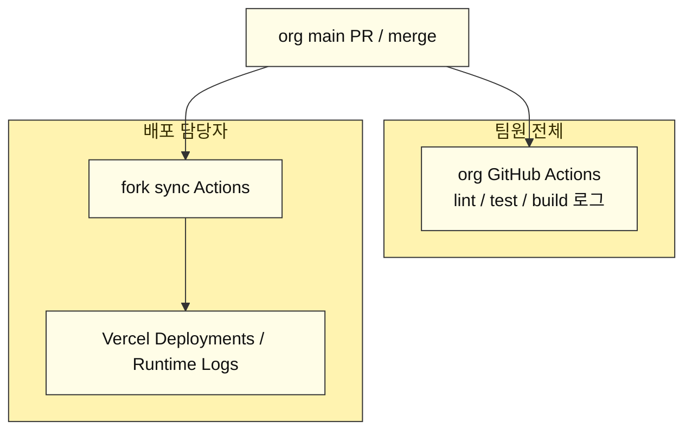
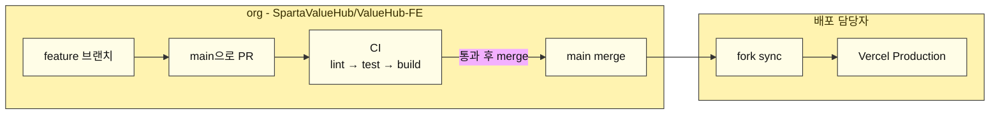
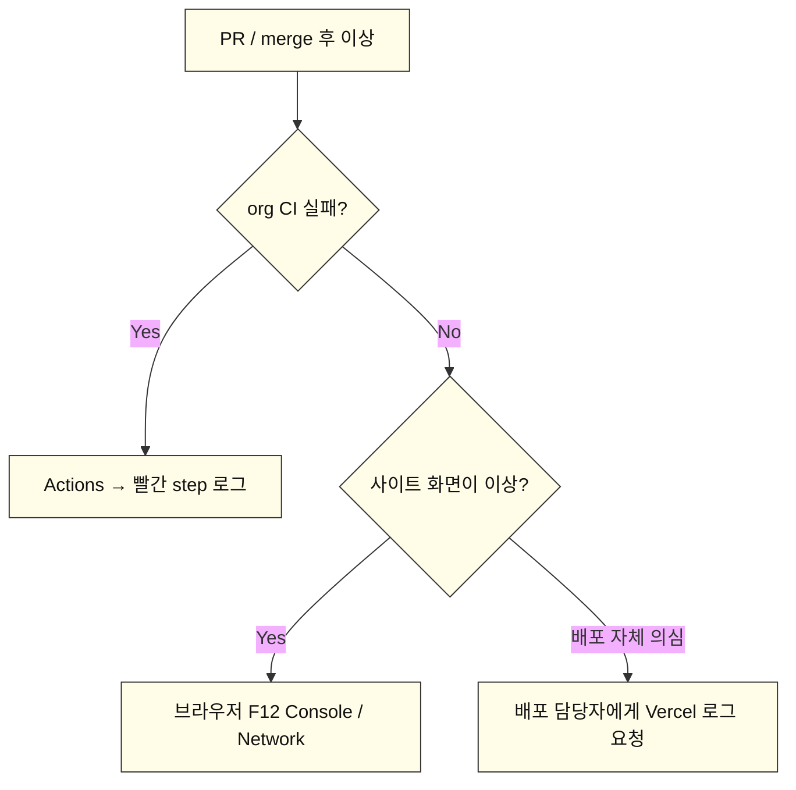

# ValueHub FE — GitHub Actions CI 안내

Vercel Hobby 플랜에서는 **팀원 초대가 불가**하다.  
그래서 프론트 검증 로그는 **org GitHub Actions**에서 본다.

실비밀값(`.env` 실값, PAT 등)은 git에 올리지 않는다.

> 아래 다이어그램은 **GitHub**에서 그림으로 렌더됩니다.  
> Cursor 미리보기·일부 게시판은 Mermaid를 코드로만 보여줄 수 있습니다.  
> 게시판용: GitHub 문서 페이지에서 렌더된 그림을 캡처해 올리거나, GitHub 링크를 공유하세요.  
> 문서 파일: `docs/github-actions-ci-team-notice.md`

---

## 한 줄 요약

| 구분 | 내용 |
| --- | --- |
| 팀원이 볼 곳 | org **GitHub Actions** |
| 레포 | https://github.com/SpartaValueHub/ValueHub-FE |
| Actions | https://github.com/SpartaValueHub/ValueHub-FE/actions |
| 워크플로우 이름 | `CI` (`lint / test / build`) |
| 언제 도나 | `main`으로 가는 **PR** / `main` **push(merge)** |
| 실행 순서 | `pnpm lint` → `pnpm test` → `pnpm build` |
| Vercel 대시보드 | 배포 담당자만 (팀 초대 불가) |

---

## 왜 org Actions인가



포인트:
- **코드가 깨졌는지** → org Actions
- **배포가 됐는지** → Vercel (담당자)
- 팀원은 Vercel 로그인/초대 없이 org 레포만 보면 된다

---

## 전체 그림 (검증 vs 배포)



| 단계 | 누가 보나 | 어디서 |
| --- | --- | --- |
| PR 검증 로그 | **팀원 전체** | org Actions / PR Checks |
| fork sync | 배포 담당자 | fork Actions |
| 실제 사이트 배포 | 배포 담당자 | Vercel Deployments |

CI가 통과했다고 해서 Vercel 배포가 끝난 것은 아니다.  
CI = **머지 전/직후 코드 검증**, Vercel = **사이트 재배포**.

---

## 팀원이 로그 보는 법

### 1) PR에서 보기 (가장 편함)

1. org 레포에서 본인/팀 PR 열기  
2. 본문 아래 **Checks** / **CI** 확인  
3. `lint / test / build` 클릭  
4. 왼쪽 step 클릭 → 오른쪽에서 로그 확인  

상태:

| 표시 | 의미 |
| --- | --- |
| 노란 점 / In progress | 돌아가는 중 |
| 초록 / Success | lint·test·build 통과 |
| 빨강 / Failure | 해당 step에서 실패 → 그 step 로그 확인 |

### 2) Actions 탭에서 보기

https://github.com/SpartaValueHub/ValueHub-FE/actions

1. 왼쪽에서 워크플로우 **`CI`** 선택  
2. 맨 위(최신) run 클릭  
3. job `lint / test / build` 클릭  
4. step 순서대로 확인  

실행 step:

| 순서 | step | 실패하면 |
| --- | --- | --- |
| 1 | Install dependencies | lockfile / 패키지 문제 |
| 2 | Lint | eslint 규칙 위반 |
| 3 | Test | vitest 실패 |
| 4 | Build | Next.js 빌드 실패 (타입/임포트 등) |

---

## 실패했을 때



| 증상 | 보는 곳 | 담당 |
| --- | --- | --- |
| PR Checks 빨강 | org Actions `CI` | 해당 PR 작성자 / 리뷰어 |
| lint 실패 | `Lint` step | FE |
| test 실패 | `Test` step | FE |
| build 실패 | `Build` step | FE |
| CI는 초록인데 배포 URL이 안 바뀜 | Vercel Deployments | 배포 담당자 |
| 화면만 깨짐 | 브라우저 Console / Network | FE |

로컬에서 같은 명령으로 재현:

```bash
pnpm lint
pnpm test
pnpm build
```

---

## 역할 분담

| 누가 | 하는 일 |
| --- | --- |
| 팀원 | PR 올리고 org Actions / Checks에서 로그 확인 |
| FE 배포 담당 | Vercel 배포, fork sync, Production URL 관리 |
| Vercel 초대 | Hobby 플랜이라 **불가** → Actions로 대체 |

---

## 경로 / 이름 정리

| 항목 | 값 |
| --- | --- |
| org 레포 | `SpartaValueHub/ValueHub-FE` |
| 워크플로우 파일 | `.github/workflows/ci.yml` |
| 워크플로우 이름 | `CI` |
| Job 이름 | `lint / test / build` |
| 트리거 | `pull_request` → `main`, `push` → `main` |
| 관련 PR | https://github.com/SpartaValueHub/ValueHub-FE/pull/81 |

---

## 체크리스트

- [ ] org 레포 Actions에서 `CI` 워크플로우가 보임  
- [ ] `main` 대상 PR에 Checks가 뜸  
- [ ] 실패 시 빨간 step 로그를 팀원이 직접 열 수 있음  
- [ ] Vercel 로그가 필요하면 배포 담당자에게 요청  

---

## 게시판용 (복붙)

```text
[FE] GitHub Actions CI 안내

Vercel은 Hobby 플랜이라 팀원 초대가 안 됩니다.
프론트 lint / test / build 로그는 org GitHub Actions에서 확인해주세요.

■ 보는 곳
https://github.com/SpartaValueHub/ValueHub-FE/actions
또는 PR 페이지 아래 Checks → lint / test / build

■ 언제 도나
main으로 PR을 올리거나, main에 merge되면 자동 실행됩니다.

■ 실행 순서
pnpm lint → pnpm test → pnpm build

■ 역할
- 코드 검증 로그: 팀원 전체 (org Actions)
- 실제 배포/런타임 로그: 배포 담당자 (Vercel)

CI가 초록이어도 사이트 배포는 별도입니다.
배포 URL 문제는 배포 담당자에게 말씀해주세요.
```
