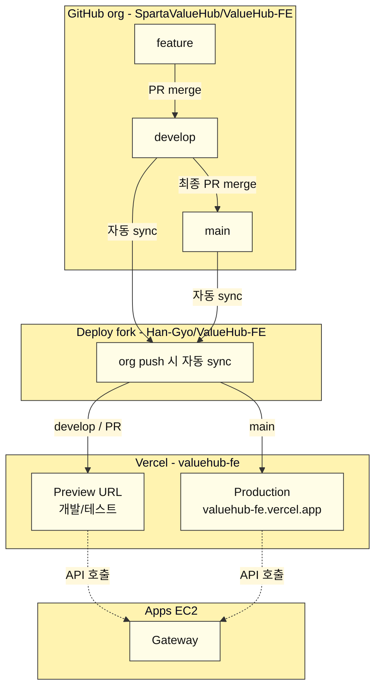
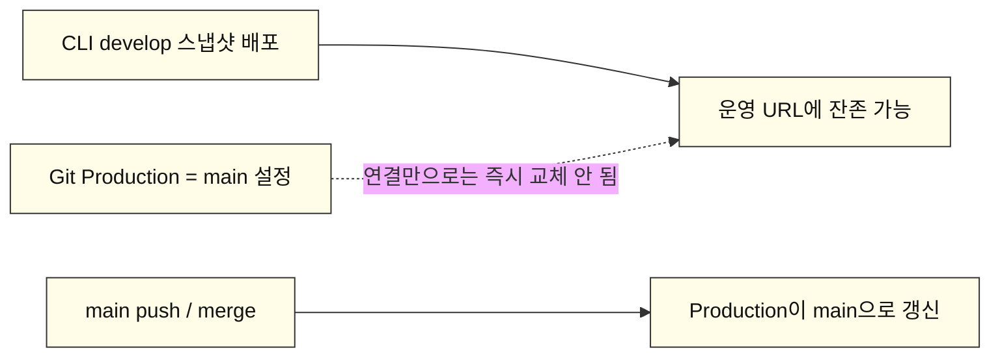
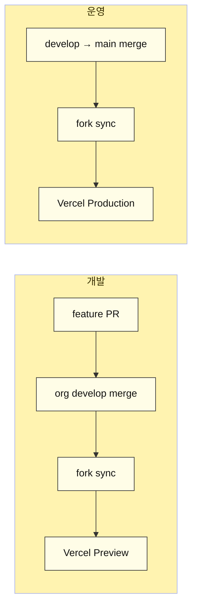
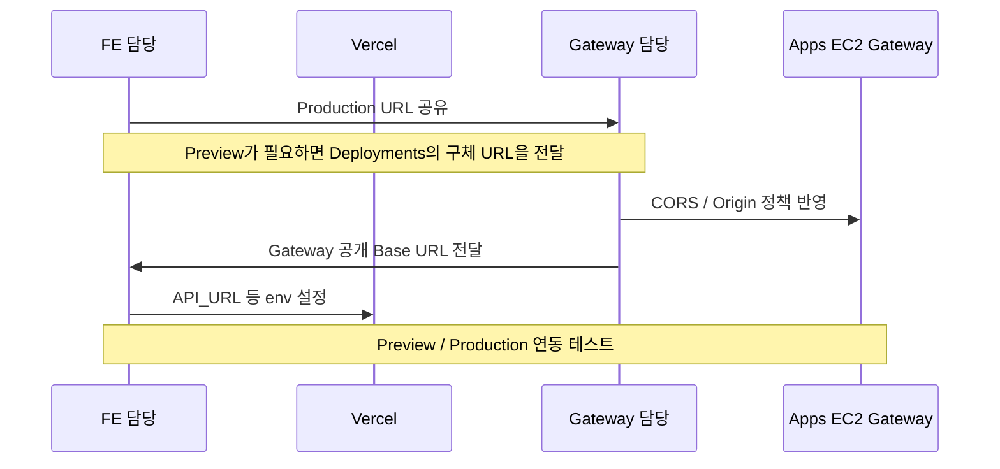
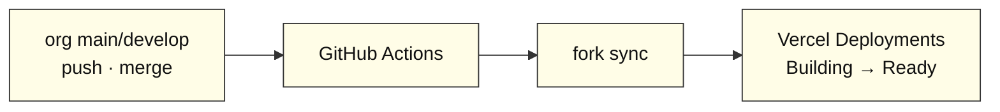
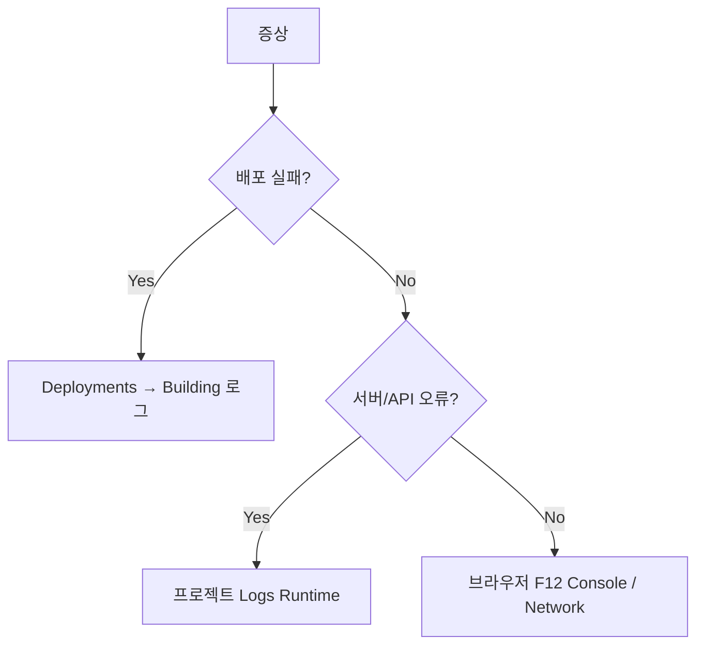

# ValueHub FE — Vercel 배포 안내

FE(Next.js)를 Vercel에 배포한 구성과, 팀/Gateway 담당과 맞출 URL·테스트·로그 확인 방법을 정리한다.  
실비밀값(`.env` 실값, PAT 등)은 git에 올리지 않는다.

---

## 한 줄 요약

| 구분 | 내용 |
| --- | --- |
| 운영 URL | https://valuehub-fe.vercel.app |
| Production Branch | `main` |
| 개발 테스트 | `develop` / PR → Vercel **Preview** URL |
| Git 연결 대상 | Hobby 제약으로 org private 직접 연결 불가 → 개인 fork `Han-Gyo/ValueHub-FE` |
| org → fork | `develop` / `main` push 시 자동 sync |
| Gateway CORS | Gateway 담당(팀장) 정책으로 관리. Preview는 **구체 URL**을 필요할 때 전달 |

---

## 전체 그림

> 아래 다이어그램은 **GitHub**에서 그림으로 렌더됩니다.  
> Cursor 미리보기·일부 게시판은 Mermaid를 코드로만 보여줄 수 있습니다.  
> 게시판용: GitHub 문서 페이지에서 렌더된 그림을 캡처해 올리거나, GitHub 링크를 공유하세요.  
> 문서 파일: `docs/vercel-deploy-team-notice.md`



포인트:
- 일상 개발은 **org 레포** 기준
- Vercel Git은 **개인 fork**에 연결
- org merge → fork sync → Vercel Preview / Production 반영
- Preview / Production 모두 런타임에 Gateway API 호출 (점선)
---

## Production URL이 예전에 보였던 이유

Git Production Branch를 `main`으로 걸어둬도, **예전에 CLI로 올린 develop 스냅샷**이 Production에 남아 있으면 그 화면이 계속 보일 수 있다.  
`main`에 push/merge가 일어나야 Production이 main 코드로 갱신된다.



| 질문 | 답 |
| --- | --- |
| Production Branch = `main`? | O |
| `main`에 코드가 없나? | X (develop보다 예전일 수 있음) |
| 언제 main 코드로 바뀌나? | `main` push / merge 시 |

---

## 코드 배포 흐름 (FE)


| 무엇을 했나 | 결과 |
| --- | --- |
| org `develop` / PR merge | Preview URL 생성 (Deployments에서 확인) |
| org `main` merge | https://valuehub-fe.vercel.app 갱신 |

---

## URL / 링크

| 항목 | 값 |
| --- | --- |
| Production | https://valuehub-fe.vercel.app |
| Vercel 프로젝트 | https://vercel.com/ggyyoo/valuehub-fe |
| org FE 레포 | https://github.com/SpartaValueHub/ValueHub-FE |
| 배포용 fork | https://github.com/Han-Gyo/ValueHub-FE |
| fork sync Actions | https://github.com/Han-Gyo/ValueHub-FE/actions |

Preview URL은 배포마다 달라진다.  
**Vercel → valuehub-fe → Deployments** 에서 Environment=`Preview` 항목의 URL을 사용한다.

---

## Gateway와 맞추는 방법



### FE → Gateway 담당에 주는 것

| 환경 | URL |
| --- | --- |
| Production | `https://valuehub-fe.vercel.app` |
| Preview | Deployments에서 확인한 **구체 URL** (필요할 때) |

### Gateway → FE에 주시면 되는 것

```text
API_URL={GATEWAY}/auth-service
MEMBER_API_URL={GATEWAY}/member-service
CATEGORY_API_URL={GATEWAY}/category-service
AUTH_TRUSTED_ORIGIN=https://valuehub-fe.vercel.app
```

---

## Vercel 테스트 절차

### Preview (develop / feature)

1. org `SpartaValueHub/ValueHub-FE`에 PR merge  
2. fork sync 확인: Actions  
3. https://vercel.com/ggyyoo/valuehub-fe → **Deployments**  
4. Preview 배포 **Visit**  
5. Gateway 연동 필요 시 해당 Preview URL을 Gateway 담당에 전달 후 API 테스트  

### Production (main)

1. `develop` → `main` merge  
2. Deployments에서 Production Ready 확인  
3. https://valuehub-fe.vercel.app 접속  

### 체크

- [ ] 배포 Status = Ready  
- [ ] Preview / Production 혼동 없음  
- [ ] 해당 Environment env 존재  
- [ ] 시크릿 창 / Hard Refresh로 캐시 배제  

---

## CI/CD 동작 중 로그 보는 법 (진행 상황)

`main`(또는 `develop`)에 push / merge 되면 **GitHub Actions → fork sync → Vercel 배포** 순으로 돌아간다.  
오류가 아니어도 **돌아가는 중**인 로그를 아래 페이지에서 볼 수 있다.



### 1) GitHub Actions (org → fork sync 등)

| 어디서 | URL |
| --- | --- |
| org Actions | https://github.com/SpartaValueHub/ValueHub-FE/actions |
| fork Actions (sync) | https://github.com/Han-Gyo/ValueHub-FE/actions |

보는 방법:

1. 위 Actions 페이지 접속  
2. 가장 위(최신) **workflow run** 클릭  
   - org: `Notify deploy fork to sync` 등  
   - fork: `Sync from upstream`  
3. 왼쪽 job 클릭 → 오른쪽에서 **실시간 step 로그** 확인  
4. 상태: `Queued` → `In progress` (노란 점) → `Success` / `Failure`

`main` merge 직후면 org Actions가 먼저 돌고, 이어서 fork Actions가 돌아야 정상이다.

### 2) Vercel 배포 진행 (Building 중)

오류가 아니어도 **빌드·배포가 도는 중**이면 여기서 본다.

| 어디서 | URL |
| --- | --- |
| Deployments 목록 | https://vercel.com/ggyyoo/valuehub-fe/deployments |
| 프로젝트 홈 | https://vercel.com/ggyyoo/valuehub-fe |

보는 방법:

1. **Deployments** 탭 열기  
2. 맨 위 배포 카드 확인  
   - Environment: `Production` (`main`) / `Preview` (`develop`·PR)  
   - Status: `Building` → `Ready` (또는 `Error`)  
3. 해당 배포 **클릭**  
4. 상단/타임라인에서 **Building** 구간 로그 펼치기  
   - `pnpm install` / `pnpm build` 출력이 실시간으로 이어짐  
5. 끝나면 Status가 **Ready** → **Visit**으로 접속

요약:

| 보고 싶은 것 | Vercel 페이지 |
| --- | --- |
| 지금 배포가 도는지 | **Deployments** 목록의 최신 행 Status |
| 빌드 로그 전문 | 배포 상세 → **Building** |
| 배포 끝난 뒤 요청 로그 | **Logs** (Runtime) — 접속·API 호출 시 |
| Git sync CI | GitHub **Actions** (위 링크) |

> **Deployments** = CI/CD처럼 “지금 빌드/배포 중”  
> **Logs** = 사이트가 떠 있는 뒤 “요청이 들어올 때” 런타임 로그  

---

## 오류 시 프론트 로그



| 증상 | 보는 곳 |
| --- | --- |
| Build Failed | Deployments → 해당 배포 → **Building** |
| 접속 중 서버 에러 | 프로젝트 → **Logs** (Preview/Production 필터) |
| 클라이언트 UI만 깨짐 | 브라우저 **Console / Network** |
| CLI | `npx vercel logs --follow --scope ggyyoo` |

- `'use client'` 로그 → 브라우저 Console  
- Server Actions / Route Handlers → Vercel Logs  

---

## 역할 분담

| 누가 | 하는 일 |
| --- | --- |
| FE | Vercel 배포, fork sync, URL/테스트/로그 가이드 공유, Gateway URL 수신 후 env 설정 |
| Gateway / 인프라 | CORS·Origin 정책, Gateway 공개 URL 전달 |

---

## 경로 / 이름 정리

| 항목 | 값 |
| --- | --- |
| Vercel Project Name | `valuehub-fe` |
| Production Domain | `valuehub-fe.vercel.app` |
| org 레포 | `SpartaValueHub/ValueHub-FE` |
| fork 레포 | `Han-Gyo/ValueHub-FE` |
| Production Branch | `main` |

---

## 체크리스트

- [x] Vercel 프로젝트 / Production URL (`valuehub-fe`)  
- [x] Production Branch = `main`  
- [x] org → fork 자동 sync  
- [ ] Gateway CORS (팀장)  
- [ ] Gateway URL → FE env  
- [ ] Preview ↔ Gateway 스모크 테스트  

---

## 팀장 전달용 (복붙)

```text
FE Vercel 배포 URL 공유드립니다.

[운영 Production]
https://valuehub-fe.vercel.app

[테스트 Preview]
develop/PR 배포마다 Vercel Deployments에 Preview URL이 생성됩니다.
- 확인: Vercel → valuehub-fe → Deployments
- 필요한 Preview Origin은 배포 URL 확인 후 전달드리겠습니다.

Gateway 공개 URL 주시면 FE env에 연결하겠습니다.
CORS 허용 범위는 Gateway 쪽 정책으로 부탁드립니다.
```
