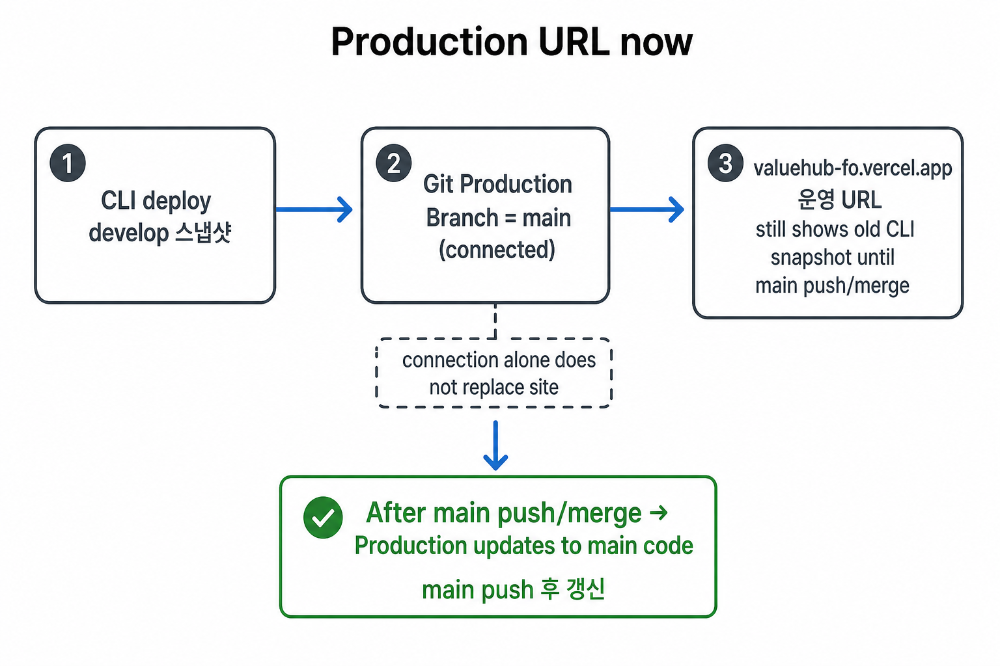
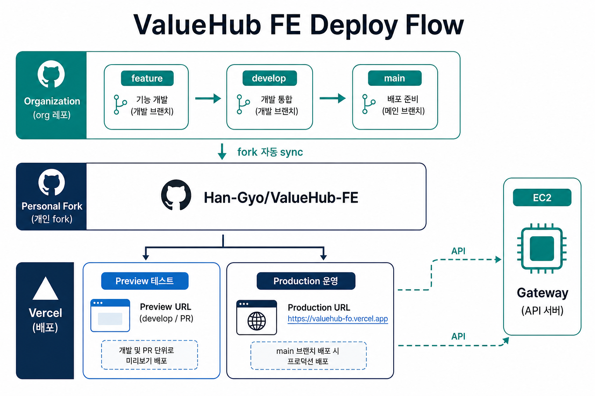
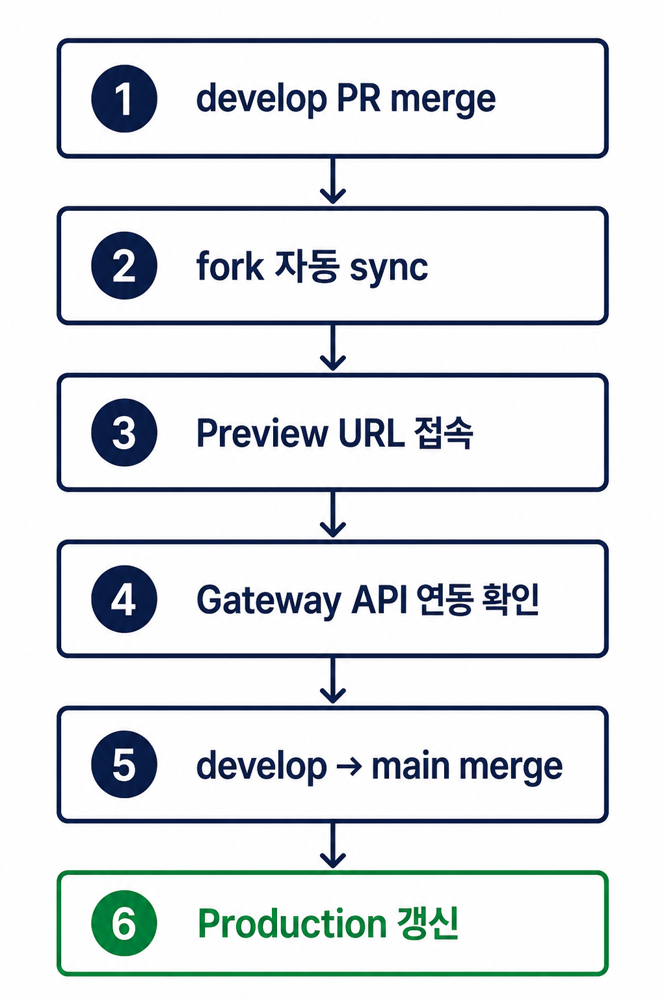

# ValueHub FE — Vercel 배포 공유

> FE 담당 → 팀 / Gateway 담당 공유용  
> 작성일: 2026-08-12

---

## 0. 먼저 읽을 것 (Production 화면에 대한 오해)



| 질문 | 답 |
|------|----|
| Production Branch가 `main`인가? | **예** (설정 맞음) |
| `main`에 코드가 없나? | **아니요.** `main`에도 코드 있음 (develop보다 예전 버전) |
| 지금 운영 URL 화면이 왜 보이나? | **예전에 CLI로 올린 develop 스냅샷**이 Production에 남아 있을 수 있음 |
| 언제 main 코드로 바뀌나? | **`main`에 push/merge가 한 번 일어날 때** |

---

## 1. 배포 흐름 (시각화)



| 구분 | 브랜치 | URL | 용도 |
|------|--------|-----|------|
| **운영 (Production)** | `main` | https://valuehub-fo.vercel.app | 실제 서비스 |
| **테스트 (Preview)** | `develop` / PR | Deployments·PR마다 **별도 URL 자동 생성** | 개발 검증 |

### 관련 링크

| 항목 | 링크 |
|------|------|
| Vercel 프로젝트 | https://vercel.com/ggyyoo/valuehub-fo |
| Production | https://valuehub-fo.vercel.app |
| org FE 레포 | https://github.com/SpartaValueHub/ValueHub-FE |
| 배포용 fork | https://github.com/Han-Gyo/ValueHub-FE |

---

## 2. FE → Gateway 담당(팀장) 공유 URL

| 환경 | URL |
|------|-----|
| Production | `https://valuehub-fo.vercel.app` |

Preview URL은 배포마다 새로 생깁니다.  
필요한 Preview Origin은 **그때그때 Deployments에서 확인한 구체 URL**을 Gateway 담당에게 전달합니다.  
(`*.vercel.app` 와일드카드는 쓰지 않음 — Gateway CORS는 팀장 정책으로 관리)

### Gateway 담당 → FE에게 나중에 주시면 되는 것

Gateway 공개 Base URL 예시:

```text
API_URL={GATEWAY}/auth-service
MEMBER_API_URL={GATEWAY}/member-service
CATEGORY_API_URL={GATEWAY}/category-service
AUTH_TRUSTED_ORIGIN=https://valuehub-fo.vercel.app
```

---

## 3. Vercel에서 테스트하는 방법



### 3-1. Preview 테스트 (develop / feature)

1. org `SpartaValueHub/ValueHub-FE`에 PR merge (`develop` 또는 feature)  
2. 개인 fork 자동 sync 확인: https://github.com/Han-Gyo/ValueHub-FE/actions  
3. Vercel 접속: https://vercel.com/ggyyoo/valuehub-fo  
4. **Deployments** 탭 → 방금 생긴 **Preview** 배포 클릭  
5. **Visit** / 배포 URL로 접속해 화면·기능 확인  
6. Gateway 연동이 필요하면, 그 Preview URL을 Gateway 담당에게 전달 후 CORS 반영된 뒤 API 테스트

```text
[개발] develop / PR → Preview URL (Deployments에서 확인)
[운영] main         → https://valuehub-fo.vercel.app
```

### 3-2. Production 테스트 (main)

1. `develop` → `main` PR merge  
2. Deployments에서 **Production** 배포 Ready 확인  
3. https://valuehub-fo.vercel.app 접속

### 3-3. 빠른 체크리스트

- [ ] 배포 Status가 **Ready** 인가  
- [ ] 잘못된 브랜치 Preview를 보고 있지 않은가  
- [ ] env(API_URL 등)가 해당 Environment(Preview/Production)에 들어 있는가  
- [ ] 브라우저 Hard Refresh / 시크릿 창으로 캐시 이슈 배제

---

## 4. 오류 났을 때 프론트 로그 보는 법

프론트 로그는 **어디가 깨졌는지**에 따라 보는 곳이 다릅니다.

| 증상 | 어디서 보나 |
|------|-------------|
| 배포 자체가 실패 (Build Failed) | Vercel → Deployments → 해당 배포 → **Building** 로그 |
| 페이지는 뜨는데 API/로그인 등 서버 오류 | Vercel → 프로젝트 → **Logs** (Runtime Logs) |
| 버튼 클릭 후 브라우저만 깨짐 | 브라우저 **DevTools → Console / Network** |
| CLI로 보고 싶을 때 | `npx vercel logs --follow --scope ggyyoo` |

### 4-1. 빌드 로그 (배포 실패)

1. https://vercel.com/ggyyoo/valuehub-fo  
2. **Deployments** → 빨간 Error / Failed 배포 클릭  
3. **Building** 구간 로그에서 `pnpm build` / TypeScript / ESLint 에러 확인

### 4-2. 런타임 로그 (접속 중 서버 에러)

1. 프로젝트 좌측 **Logs**  
   또는 배포 상세 → Runtime Logs  
2. Environment를 **Preview** / **Production** 으로 필터  
3. Status `4xx` / `5xx`, path(`/signin` 등)로 좁혀 보기  
4. Server Action / Route Handler / `console` 서버 출력 확인

> 클라이언트 컴포넌트(`'use client'`)의 `console.log`는 **브라우저 Console**에 나옵니다.  
> 서버( RSC, Server Actions, Route Handlers ) 로그는 **Vercel Logs**에 나옵니다.

### 4-3. 브라우저에서 바로 볼 것

1. `F12` → **Console**: JS 에러  
2. **Network**: API 실패 상태코드, response body  
3. 필요 시 Preview/Production URL을 시크릿 창으로 재현

---

## 5. 역할 분담

| 담당 | 할 일 | 상태 |
|------|--------|------|
| FE | Vercel 배포, Production=`main`, fork 자동 sync | 완료 |
| FE | Production URL / Preview 확인 방법 공유 | 이 문서 |
| Gateway | CORS 허용 범위 정책·설정 | 팀장 |
| Gateway | Gateway 공개 URL 전달 | 대기 |
| FE | Vercel API env + 연동 테스트 | URL 수신 후 |

---

## 6. 왜 개인 fork인가?

- Vercel Hobby는 **org private 레포** 직접 Git 연결 불가  
- 배포 Git = `Han-Gyo/ValueHub-FE` fork  
- org merge 시 fork **자동 sync**  
- 일상 개발은 계속 **org 레포** 기준  

---

## 7. 체크리스트

- [x] Vercel Production URL  
- [x] Production Branch = `main`  
- [x] org → fork 자동 sync  
- [ ] Gateway CORS (팀장 정책으로 관리)  
- [ ] Gateway URL → FE env (FE)  
- [ ] Preview ↔ Gateway 스모크 테스트  

---

## 팀장 전달용 메시지 (복붙)

```text
FE Vercel 배포 URL 공유드립니다.

[운영 Production]
https://valuehub-fo.vercel.app

[테스트 Preview]
develop/PR 배포마다 Vercel Deployments에 Preview URL이 생성됩니다.
- 확인: Vercel → valuehub-fo → Deployments
- 필요한 Preview Origin은 배포 URL을 확인 후 전달드리겠습니다.
  (*.vercel.app 와일드카드는 사용하지 않습니다)

Gateway 공개 URL 주시면 FE env에 연결하겠습니다.
CORS 허용 범위는 Gateway 쪽 정책으로 부탁드립니다.
```
