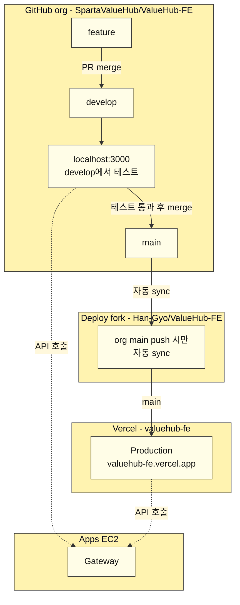
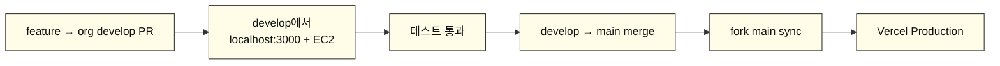
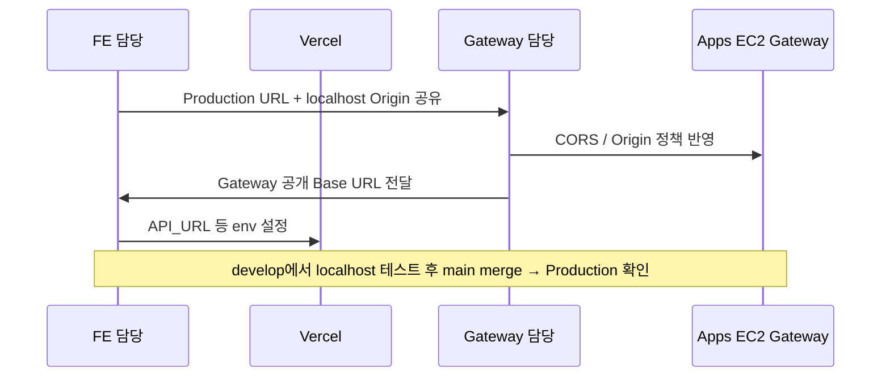
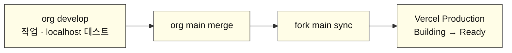
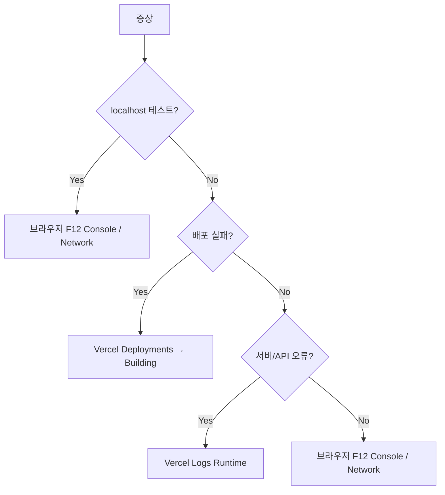

# ValueHub FE — Vercel 배포 안내

FE(Next.js)를 Vercel에 배포한 구성과, 팀/Gateway 담당과 맞출 URL·테스트·로그 확인 방법을 정리한다.  
실비밀값(`.env` 실값, PAT 등)은 git에 올리지 않는다.

현재 브랜치 전략:

- **org** (`SpartaValueHub/ValueHub-FE`): `develop`에서 작업·테스트 후 `main`으로 merge
- **개인 fork / Vercel**: **`main`만** sync·배포. fork의 `develop`은 안 씀

---

## 한 줄 요약

| 구분 | 내용 |
| --- | --- |
| 운영 URL | https://valuehub-fe.vercel.app |
| Production Branch | `main` |
| org 작업 | `develop`에서 feature PR/merge |
| 테스트 | **org `develop`** 기준으로 **localhost:3000** + EC2 Gateway |
| 운영 반영 | 테스트 통과 후 org `develop` → `main` merge |
| Git 연결 대상 | Hobby 제약으로 org private 직접 연결 불가 → 개인 fork `Han-Gyo/ValueHub-FE` |
| org → fork | org `main` push / merge 시 **main만** 자동 sync |
| 재배포 | fork `main`이 바뀌면 Vercel **Production** 자동 배포 |
| fork develop | 최신화 안 함. Vercel Preview도 없음 |
| Gateway CORS | `https://valuehub-fe.vercel.app`, `http://localhost:3000` |

---

## 전체 그림

> 아래 다이어그램은 **GitHub**에서 그림으로 렌더됩니다.  
> Cursor 미리보기·일부 게시판은 Mermaid를 코드로만 보여줄 수 있습니다.  
> 게시판용: GitHub 문서 페이지에서 렌더된 그림을 캡처해 올리거나, GitHub 링크를 공유하세요.  
> 문서 파일: `docs/vercel-deploy-team-notice.md`



포인트:
- **org는 `develop` 사용함.** feature → `develop` PR/merge
- **localhost:3000 테스트는 org `develop`에서** (EC2 Gateway에 붙임)
- 통과하면 org `develop` → `main` merge
- 개인 fork / Vercel은 **`main`만** 봄. fork `develop`은 sync 안 함
- org `develop` merge만으로는 Production URL이 안 바뀜
- Production / localhost 모두 같은 EC2 Gateway 호출 (점선)

---

## Production URL이 예전에 보였던 이유

Git Production Branch를 `main`으로 걸어둬도, **예전에 CLI로 올린 스냅샷**이 Production에 남아 있으면 그 화면이 계속 보일 수 있다.  
org `main`에 merge가 일어나야 Production이 최신 코드로 갱신된다.


| 질문 | 답 |
| --- | --- |
| Production Branch = `main`? | O |
| org `develop` merge면 URL이 바뀌나? | X |
| 언제 Production이 바뀌나? | org `main` merge → fork sync 이후 |

---

## 코드 배포 흐름 (FE)



| 무엇을 했나 | 결과 |
| --- | --- |
| org `develop` PR/merge | 코드 통합. Vercel은 안 움직임 |
| org `develop`에서 `pnpm dev` | **localhost:3000** 으로 EC2 연동 테스트 |
| org `main` merge | fork `main` sync → https://valuehub-fe.vercel.app 갱신 |

참고:
- Vercel / 개인 fork는 **`main`만** 연결됨
- org `develop`은 팀 작업·테스트용
- develop용 Vercel Preview URL은 없음
- develop 테스트 URL을 Production URL이랑 같게 만드는 방법은 **없음**

---

## develop에서 테스트 (localhost)

`main` merge **전에** 화면/API를 보려면 org `develop`을 받아서 **로컬 FE + EC2** 로 본다.

```text
git checkout develop
pnpm dev
→ http://localhost:3000
→ EC2 Gateway API 호출
```

| 단계 | 하는 일 |
| --- | --- |
| 1 | org `develop`에 feature PR merge |
| 2 | 로컬에서 `develop` 최신화 |
| 3 | `.env`에 EC2 Gateway URL (`API_URL` 등) |
| 4 | Gateway CORS에 `http://localhost:3000` 허용 |
| 5 | `pnpm dev` → http://localhost:3000 |
| 6 | 통과하면 `develop` → `main` merge |

로컬로 안 잡히는 것: Vercel env 누락, Production 빌드 이슈  
→ 보완은 `main` merge 후 Production URL

---

## URL / 링크

| 항목 | 값 |
| --- | --- |
| Production | https://valuehub-fe.vercel.app |
| Vercel 프로젝트 | https://vercel.com/ggyyoo/valuehub-fe |
| org FE 레포 | https://github.com/SpartaValueHub/ValueHub-FE |
| 배포용 fork | https://github.com/Han-Gyo/ValueHub-FE |
| org CI Actions | https://github.com/SpartaValueHub/ValueHub-FE/actions |
| fork sync Actions | https://github.com/Han-Gyo/ValueHub-FE/actions |

---

## Gateway와 맞추는 방법



### FE → Gateway 담당에 주는 것

| 환경 | Origin |
| --- | --- |
| Production | `https://valuehub-fe.vercel.app` |
| develop 로컬 테스트 | `http://localhost:3000` |

### Gateway → FE에 주시면 되는 것

```text
API_URL={GATEWAY}/auth-service
MEMBER_API_URL={GATEWAY}/member-service
CATEGORY_API_URL={GATEWAY}/category-service
AUTH_TRUSTED_ORIGIN=https://valuehub-fe.vercel.app
# 로컬 테스트는 .env 에 같은 Gateway URL + CORS localhost:3000
```

---

## 테스트 절차

### 1) org develop — localhost

1. feature를 org `develop`에 PR merge  
2. 로컬에서 `develop` checkout / pull  
3. `pnpm dev` → http://localhost:3000  
4. EC2 Gateway 연동 확인 (로그인/API)  
5. 통과하면 `develop` → `main` PR  

### 2) org main merge 후 — Production

1. org `main` merge  
2. org Actions에서 `Notify deploy fork to sync` 확인  
3. fork Actions에서 `Sync from upstream` 확인  
4. https://vercel.com/ggyyoo/valuehub-fe → **Deployments**  
5. Production Ready 확인 후 https://valuehub-fe.vercel.app 접속  

### 체크

- [ ] localhost에서 EC2 API 동작  
- [ ] 배포 Status = Ready  
- [ ] Environment = Production  
- [ ] 시크릿 창 / Hard Refresh로 캐시 배제  

---

## CI/CD 동작 중 로그 보는 법 (진행 상황)

org `main`에 merge 되면 **fork sync → Vercel 배포** 가 돈다.  
org `develop` merge만으로는 이 파이프라인이 **안 돈다.**



### 1) GitHub Actions

| 어디서 | URL | 누가 보나 |
| --- | --- | --- |
| org CI (lint / test / build) | https://github.com/SpartaValueHub/ValueHub-FE/actions | **팀원 전체** |
| org notify (fork sync 요청) | 같은 Actions 탭의 `Notify deploy fork to sync` | 배포 담당 |
| fork Actions (sync) | https://github.com/Han-Gyo/ValueHub-FE/actions | 배포 담당 |

보는 방법:

1. 위 Actions 페이지 접속  
2. 가장 위(최신) **workflow run** 클릭  
   - org: `CI`, `Notify deploy fork to sync`  
   - fork: `Sync from upstream`  
3. 왼쪽 job 클릭 → 오른쪽에서 **실시간 step 로그** 확인  
4. 상태: `Queued` → `In progress` (노란 점) → `Success` / `Failure`

`main` merge 직후면 org notify가 먼저 돌고, 이어서 fork sync가 돌아야 정상이다.

### 2) Vercel 배포 진행 (Building 중)

Vercel 대시보드는 Hobby 플랜이라 **배포 담당자만** 볼 수 있다.

| 어디서 | URL |
| --- | --- |
| Deployments 목록 | https://vercel.com/ggyyoo/valuehub-fe/deployments |
| 프로젝트 홈 | https://vercel.com/ggyyoo/valuehub-fe |

보는 방법:

1. **Deployments** 탭 열기  
2. 맨 위 배포 카드 확인  
   - Environment: `Production` (`main`)  
   - Status: `Building` → `Ready` (또는 `Error`)  
3. 해당 배포 **클릭**  
4. **Building** 로그 확인  
5. Ready → **Visit**

요약:

| 보고 싶은 것 | 어디서 |
| --- | --- |
| develop 화면/API 테스트 | **localhost:3000** |
| fork가 맞춰졌는지 | fork Actions **Sync from upstream** |
| 지금 배포가 도는지 | Vercel **Deployments** |
| 빌드 로그 전문 | 배포 상세 → **Building** |
| 배포 끝난 뒤 요청 로그 | Vercel **Logs** (Runtime) |

> **localhost** = develop 테스트  
> **Deployments** = main 배포 중  
> **Logs** = Production 요청 런타임 로그  

---

## 오류 시 프론트 로그



| 증상 | 보는 곳 |
| --- | --- |
| develop localhost에서 API 실패 | F12 Network + Gateway CORS/`API_URL` |
| PR Checks 빨강 | org Actions → `CI` |
| Build Failed | Deployments → 해당 배포 → **Building** |
| 접속 중 서버 에러 | 프로젝트 → **Logs** (Production 필터) |
| 클라이언트 UI만 깨짐 | 브라우저 **Console / Network** |

- `'use client'` 로그 → 브라우저 Console  
- Server Actions / Route Handlers → Vercel Logs  

---

## 역할 분담

| 누가 | 하는 일 |
| --- | --- |
| 팀원 | org `develop`에서 작업, localhost:3000 테스트, 통과 후 `main` merge |
| FE 배포 담당 | Vercel 배포, fork **main** sync, URL/테스트/로그 가이드 공유 |
| Gateway / 인프라 | CORS·Origin 정책, Gateway 공개 URL 전달 |

---

## 경로 / 이름 정리

| 항목 | 값 |
| --- | --- |
| Vercel Project Name | `valuehub-fe` |
| Production Domain | `valuehub-fe.vercel.app` |
| org 레포 | `SpartaValueHub/ValueHub-FE` |
| fork 레포 | `Han-Gyo/ValueHub-FE` |
| org 작업 브랜치 | `develop` |
| 배포 / fork sync | **main만** |
| 테스트 | org `develop` + localhost:3000 |

---

## 체크리스트

- [x] Vercel 프로젝트 / Production URL (`valuehub-fe`)  
- [x] Production Branch = `main`  
- [x] org `main` → fork `main` 자동 sync (develop는 fork에 안 맞춤)  
- [ ] Gateway CORS: Production + `http://localhost:3000`  
- [ ] Gateway URL → FE env / 로컬 `.env`  
- [ ] develop localhost ↔ Gateway 스모크 테스트  
- [ ] Production ↔ Gateway 스모크 테스트  

---

## 팀장 전달용 (복붙)

```text
FE Vercel 배포 URL 공유드립니다.

[운영 Production]
https://valuehub-fe.vercel.app

org에서는 develop에서 작업하고 localhost:3000 + EC2로 테스트합니다.
테스트 통과 후 develop → main merge 하면 fork main sync → Vercel Production이 갱신됩니다.
개인 fork / Vercel은 main만 봅니다. develop merge만으로는 배포 URL이 바뀌지 않습니다.

Gateway 공개 URL 주시면 FE env에 연결하겠습니다.
CORS 허용 Origin:
- https://valuehub-fe.vercel.app
- http://localhost:3000
```
