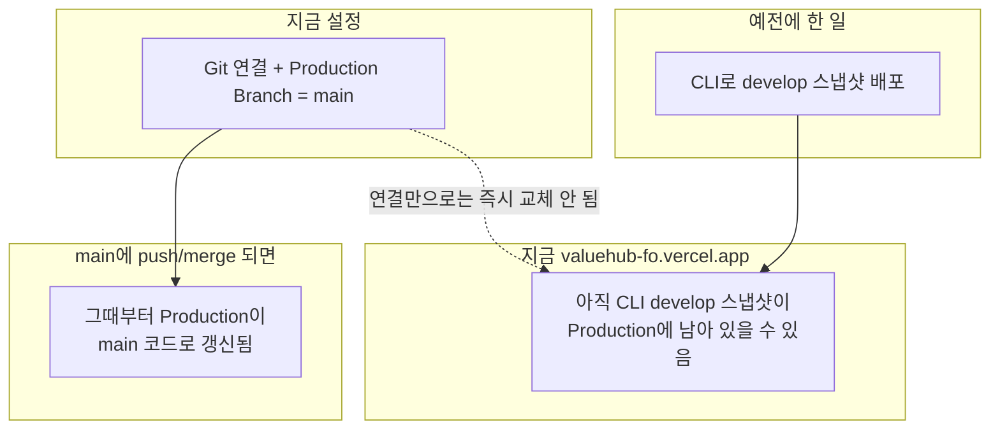
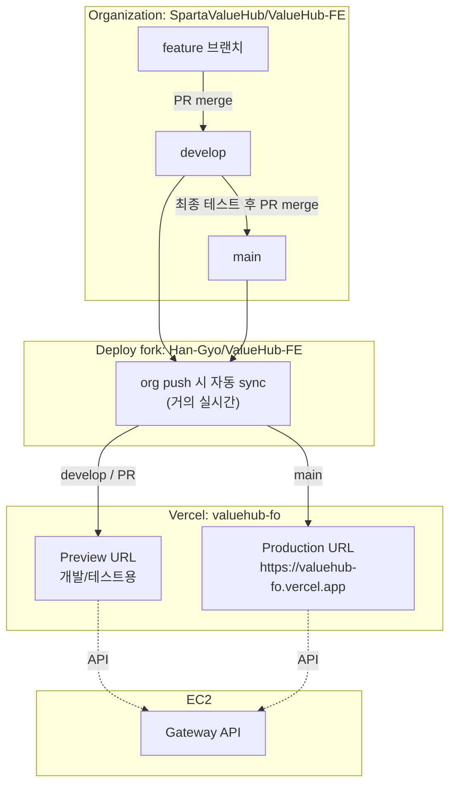
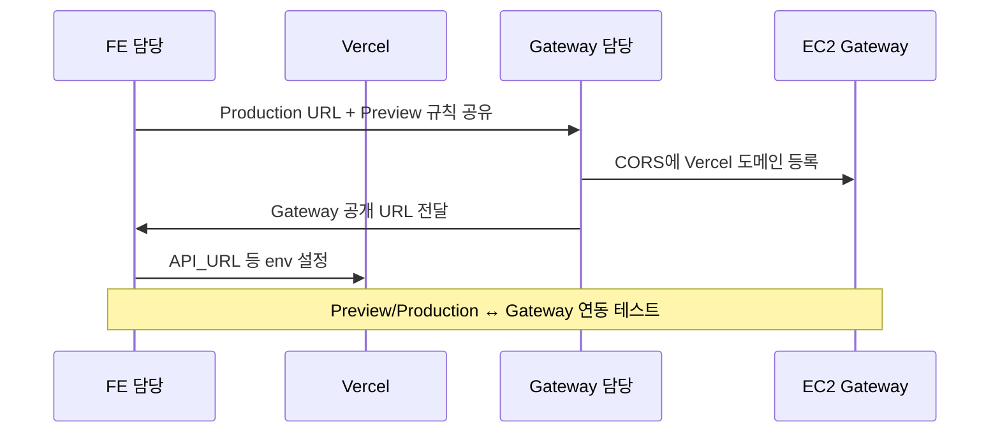
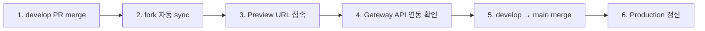

# ValueHub FE — Vercel 배포 공유

> FE 담당 → 팀 / Gateway 담당 공유용  
> 작성일: 2026-08-12

---

## 0. 먼저 읽을 것 (Production 화면에 대한 오해)



| 질문 | 답 |
|------|----|
| Production Branch가 `main`인가? | **예** (설정 맞음) |
| `main`에 코드가 없나? | **아니요.** `main`에도 코드 있음 (develop보다 예전 버전) |
| 지금 운영 URL 화면이 왜 보이나? | **예전에 CLI로 올린 develop 스냅샷**이 Production에 남아 있을 수 있음 |
| 언제 main 코드로 바뀌나? | **`main`에 push/merge가 한 번 일어날 때** |

---

## 1. 한눈에 보는 배포 흐름



| 구분 | 브랜치 | URL | 용도 |
|------|--------|-----|------|
| **운영 (Production)** | `main` | https://valuehub-fo.vercel.app | 실제 서비스 |
| **테스트 (Preview)** | `develop` / PR | Deployments·PR마다 **별도 URL 자동 생성** | 개발 검증 |

---

## 2. FE → Gateway 담당(팀장)에게 전달하는 URL

Gateway CORS / Origin 허용용입니다.

| 환경 | URL | 설명 |
|------|-----|------|
| Production | `https://valuehub-fo.vercel.app` | 운영 FE |
| Preview | `https://*.vercel.app` | 테스트 FE (`*` = 와일드카드, 서비스명 아님) |

> Preview는 배포마다 주소가 바뀝니다.  
> 특정 주소 확인: Vercel → `valuehub-fo` → **Deployments**

### 관련 링크

| 항목 | 링크 |
|------|------|
| Vercel 프로젝트 | https://vercel.com/ggyyoo/valuehub-fo |
| Production | https://valuehub-fo.vercel.app |
| org FE 레포 | https://github.com/SpartaValueHub/ValueHub-FE |
| 배포용 fork | https://github.com/Han-Gyo/ValueHub-FE |

---

## 3. Gateway 담당 → FE에게 나중에 주시면 되는 것

Gateway 배포 후 **공개 Gateway Base URL**만 주시면 됩니다.

```text
API_URL={GATEWAY}/auth-service
MEMBER_API_URL={GATEWAY}/member-service
CATEGORY_API_URL={GATEWAY}/category-service
AUTH_TRUSTED_ORIGIN=https://valuehub-fo.vercel.app
```

---

## 4. 역할 / 순서



| 담당 | 할 일 | 상태 |
|------|--------|------|
| FE | Vercel 배포, Production=`main`, fork 자동 sync | 완료 |
| FE | Production / Preview URL 공유 | 이 문서 |
| Gateway | CORS에 Vercel 도메인 허용 | 팀장 |
| Gateway | Gateway 공개 URL 전달 | 대기 |
| FE | Vercel API env + 연동 테스트 | URL 수신 후 |

---

## 5. 개발자가 테스트하는 방법



```text
[개발] develop → Preview URL
[운영] main    → https://valuehub-fo.vercel.app
```

---

## 6. 왜 개인 fork인가?

- Vercel Hobby는 **org private 레포** 직접 Git 연결 불가
- 배포 Git = `Han-Gyo/ValueHub-FE` fork
- org merge 시 fork **자동 sync**
- 일상 개발은 계속 **org 레포** 기준

---

## 7. 체크리스트

- [x] Vercel Production URL
- [x] Production Branch = `main`
- [x] org → fork 자동 sync
- [ ] Gateway CORS (팀장)
- [ ] Gateway URL → FE env (FE)
- [ ] Preview ↔ Gateway 스모크 테스트

---

## 팀장 전달용 메시지 (복붙)

```text
FE Vercel 배포 URL 공유드립니다.

[운영 Production]
https://valuehub-fo.vercel.app

[테스트 Preview]
develop/PR 배포마다 Vercel이 별도 URL을 자동 생성합니다.
- 확인: Vercel → valuehub-fo → Deployments
- CORS 허용 요청:
  - https://valuehub-fo.vercel.app
  - https://*.vercel.app

Gateway 공개 URL 주시면 FE env에 연결하겠습니다.
```
